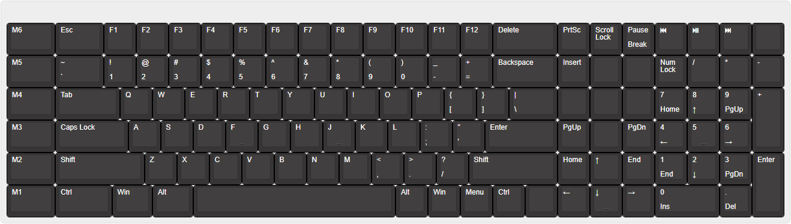

# `custom-keyboard`

## Layout

[JSON](https://gist.githubusercontent.com/rzjnzk/c866bcbde69c89530b563152486ffa42/raw/ec5cddb15496c4c3036053de017149e9be1c4937/custom-keyboard.kbd.json)

[Keyboard Layout Editor](http://www.keyboard-layout-editor.com/#/gists/c866bcbde69c89530b563152486ffa42)

