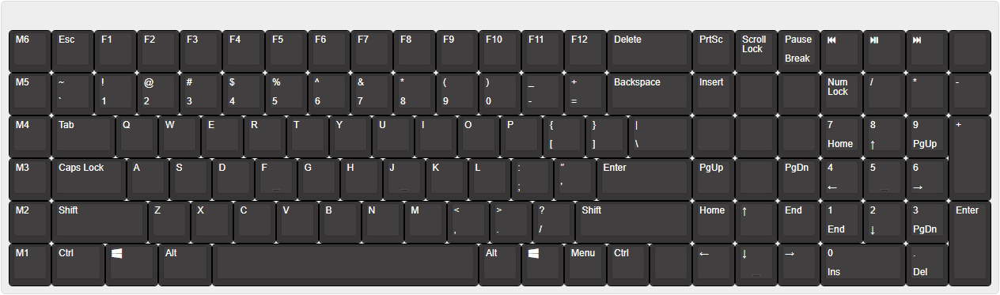

# `custom-keyboard`

## Layout

[JSON](./design/keyboard-layout.json)

[Keyboard Layout Editor](http://www.keyboard-layout-editor.com/##@@_y:0.5&c=%23373535&t=%23ffffff%3B&=M6&=Esc&=F1&=F2&=F3&=F4&=F5&=F6&=F7&=F8&=F9&=F10&=F11&=F12&_w:2%3B&=Delete&=PrtSc&=Scroll%20Lock&=Pause%0ABreak&_a:7%3B&=&=&=&=%3B&@_a:4%3B&=M5&=~%0A%60&=!%0A1&=%2F@%0A2&=%23%0A3&=$%0A4&=%25%0A5&=%5E%0A6&=%2F&%0A7&=*%0A8&=(%0A9&=)%0A0&=%2F_%0A-&=+%0A%2F=&_w:2%3B&=Backspace&=Insert&_a:7%3B&=&=&_a:4%3B&=Num%20Lock&=%2F%2F&=*&=-%3B&@=M4&_w:1.5%3B&=Tab&=Q&=W&=E&=R&=T&=Y&=U&=I&=O&=P&=%7B%0A%5B&=%7D%0A%5D&_w:1.5%3B&=%7C%0A%5C&_a:7%3B&=&=&=&_a:4%3B&=7%0AHome&=8%0A%E2%86%91&=9%0APgUp&_h:2%3B&=+%3B&@=M3&_w:1.75%3B&=Caps%20Lock&=A&=S&=D&_sm=cherry&n:true%3B&=F&=G&=H&_n:true%3B&=J&=K&=L&=%2F:%0A%2F%3B&=%22%0A'&_w:2.25%3B&=Enter&=PgUp&_a:7%3B&=&_a:4%3B&=PgDn&=4%0A%E2%86%90&_n:true%3B&=5&=6%0A%E2%86%92%3B&@=M2&_w:2.25%3B&=Shift&=Z&=X&=C&=V&=B&=N&=M&=%3C%0A,&=%3E%0A.&=%3F%0A%2F%2F&_w:2.75%3B&=Shift&=Home&=%E2%86%91&=End&=1%0AEnd&=2%0A%E2%86%93&=3%0APgDn&_h:2%3B&=Enter%3B&@=M1&_w:1.25%3B&=Ctrl&_w:1.25%3B&=Win&_w:1.25%3B&=Alt&_a:7&w:6.25%3B&=&_a:4%3B&=Alt&=Win&=Menu&=Ctrl&_a:7%3B&=&_a:4%3B&=%E2%86%90&_n:true%3B&=%E2%86%93&=%E2%86%92&_w:2%3B&=0%0AIns&=.%0ADel)

